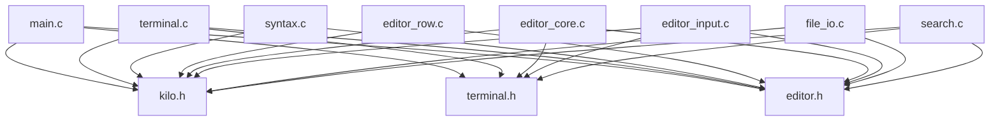

# Kilo 文本编辑器 - 完整架构分析与模块化实现

一个不到1千行代码的简洁文本编辑器，现已重构为标准的多文件项目结构，非常适合学习C语言和终端编程。

## 项目简介

Kilo是一个极简的终端文本编辑器，具有以下特点：

- **轻量级**：不依赖任何外部库（甚至不需要curses）
- **跨平台**：使用标准VT100终端转义序列
- **功能完整**：支持基本的文本编辑、搜索、语法高亮等功能
- **代码简洁**：核心代码不到1千行，易于理解和修改
- **模块化设计**：已重构为标准的多文件项目结构
- **学习价值**：涵盖了系统编程、终端控制、数据结构等多个知识点

## 🚀 快速开始

### 编译和运行

```bash
# 使用 CMake 构建（推荐）
mkdir build && cd build
cmake ..
make

# 或使用构建脚本
./build.sh
```

## 项目架构全解析

### 新的模块化文件结构
```
kilo/
├── include/              # 头文件目录
│   ├── kilo.h           # 主头文件，包含公共定义和结构体
│   ├── terminal.h       # 终端处理相关函数声明
│   └── editor.h         # 编辑器功能相关函数声明
├── src/                 # 源代码目录
│   ├── main.c           # 主程序入口 (44行)
│   ├── terminal.c       # 终端处理和原始模式 (242行)
│   ├── syntax.c         # 语法高亮处理 (233行)
│   ├── editor_row.c     # 编辑器行操作 (164行)
│   ├── editor_core.c    # 编辑器核心功能 (157行)
│   ├── editor_input.c   # 编辑器输入处理 (204行)
│   ├── file_io.c        # 文件读写操作 (61行)
│   └── search.c         # 搜索功能 (122行)
├── build/               # 构建输出目录
├── CMakeLists.txt       # CMake 构建配置
├── build.sh             # 构建脚本
├── kilo.c              # 原始单文件版本（保持不变）
└── README.md           # 说明文档

```
## 模块化设计详解

### 📁 头文件模块

#### 1. `include/kilo.h` - 主头文件 (118行)
```c
// 版本信息和系统头文件
#define KILO_VERSION "0.0.1"
#include <termios.h>
#include <stdlib.h>
// ... 更多系统头文件

// 语法高亮类型定义
#define HL_NORMAL 0
#define HL_NONPRINT 1
#define HL_COMMENT 2
// ... 更多高亮类型

// 核心数据结构
typedef struct erow {       // 文本行结构
    int idx;                // 行索引
    int size;               // 原始大小
    int rsize;              // 渲染后大小
    char *chars;            // 原始内容
    char *render;           // 渲染内容（处理TAB等）
    unsigned char *hl;      // 语法高亮信息
    int hl_oc;              // 多行注释状态
} erow;

struct editorConfig {       // 编辑器全局状态
    int cx, cy;             // 光标位置
    int rowoff, coloff;     // 视口偏移
    int screenrows, screencols; // 屏幕尺寸
    int numrows;            // 文件行数
    int rawmode;            // 终端模式标志
    erow *row;              // 文本行数组
    int dirty;              // 修改标志
    char *filename;         // 文件名
    char statusmsg[80];     // 状态消息
    time_t statusmsg_time;  // 消息时间戳
    struct editorSyntax *syntax; // 语法配置
};

// 全局编辑器状态
extern struct editorConfig E;
```

#### 2. `include/terminal.h` - 终端控制接口
```c
// 终端处理函数
void disableRawMode(int fd);
void editorAtExit(void);
int enableRawMode(int fd);
int editorReadKey(int fd);
int getCursorPosition(int ifd, int ofd, int *rows, int *cols);
int getWindowSize(int ifd, int ofd, int *rows, int *cols);
void updateWindowSize(void);
void handleSigWinCh(int unused);

// 缓冲区函数
void abAppend(struct abuf *ab, const char *s, int len);
void abFree(struct abuf *ab);
```

#### 3. `include/editor.h` - 编辑器功能接口
```c
// 编辑器核心函数
void initEditor(void);
void editorSetStatusMessage(const char *fmt, ...);
void editorRefreshScreen(void);

// 语法高亮函数
int is_separator(int c);
void editorUpdateSyntax(erow *row);
int editorSyntaxToColor(int hl);
void editorSelectSyntaxHighlight(char *filename);

// 文件操作函数
int editorOpen(char *filename);
int editorSave(void);

// 搜索和输入处理
void editorFind(int fd);
void editorProcessKeypress(int fd);
```

### 📄 源文件模块

#### 1. `src/main.c` - 程序入口 (44行)
```c
#include "kilo.h"
#include "terminal.h"
#include "editor.h"

int main(int argc, char **argv) {
    if (argc != 2) {
        fprintf(stderr, "Usage: kilo <filename>\n");
        exit(1);
    }

    initEditor();
    editorSelectSyntaxHighlight(argv[1]);
    editorOpen(argv[1]);
    enableRawMode(STDIN_FILENO);
    editorSetStatusMessage(
        "HELP: Ctrl-S = save | Ctrl-Q = quit | Ctrl-F = find");
    
    while (1) {
        editorRefreshScreen();
        editorProcessKeypress(STDIN_FILENO);
    }
    return 0;
}
```

#### 2. `src/terminal.c` - 终端控制模块 (242行)
- **原始模式管理**：`enableRawMode()`, `disableRawMode()`
- **键盘输入处理**：`editorReadKey()` - 处理转义序列
- **窗口尺寸检测**：`getWindowSize()`, `getCursorPosition()`
- **信号处理**：`handleSigWinCh()` - 窗口大小变化
- **缓冲区操作**：`abAppend()`, `abFree()`

**终端原始模式详解：**
```c
// 输入模式标志清除
raw.c_iflag &= ~(BRKINT | ICRNL | INPCK | ISTRIP | IXON);
// BRKINT: 禁用Ctrl-C产生SIGINT
// ICRNL:  禁用回车转换为换行
// INPCK:  禁用奇偶校验
// ISTRIP: 禁用第8位清零
// IXON:   禁用Ctrl-S/Ctrl-Q流控制

// 输出模式标志清除
raw.c_oflag &= ~(OPOST);
// OPOST: 禁用输出处理（如\n转\r\n）

// 控制模式设置
raw.c_cflag |= (CS8);
// CS8: 设置8位字符

// 本地模式标志清除
raw.c_lflag &= ~(ECHO | ICANON | IEXTEN | ISIG);
// ECHO:   禁用回显
// ICANON: 禁用规范模式（逐字符读取）
// IEXTEN: 禁用扩展输入处理
// ISIG:   禁用信号字符处理
```

#### 3. `src/syntax.c` - 语法高亮系统 (233行)
```c
// 语法规则数据库
char *C_HL_extensions[] = {".c", ".h", ".cpp", ".hpp", ".cc", NULL};
char *C_HL_keywords[] = {
    "auto", "break", "case", "continue", "default", "do", "else", "enum",
    // ... 更多关键字
    "int|", "long|", "double|", "float|", "char|", "unsigned|", "signed|",
    // ... 类型关键字（带|后缀表示不同颜色）
    NULL
};

struct editorSyntax HLDB[] = {
    {
        C_HL_extensions,    // 文件扩展名匹配
        C_HL_keywords,      // 关键字数组
        "//", "/*", "*/",   // 注释分隔符
        HL_HIGHLIGHT_STRINGS | HL_HIGHLIGHT_NUMBERS // 高亮标志
    }
};

// 核心函数
void editorUpdateSyntax(erow *row);         // 更新语法高亮
int editorSyntaxToColor(int hl);            // 高亮类型转颜色
void editorSelectSyntaxHighlight(char *filename); // 根据文件名选择语法
```

#### 4. `src/editor_row.c` - 文本行管理 (164行)
```c
// 核心函数
void editorUpdateRow(erow *row);    // 更新行渲染
void editorInsertRow(int at, char *s, size_t len); // 插入行
void editorFreeRow(erow *row);      // 释放行内存
void editorDelRow(int at);          // 删除行
char *editorRowsToString(int *buflen); // 行转字符串
void editorRowInsertChar(erow *row, int at, int c); // 行内插入字符
void editorRowAppendString(erow *row, char *s, size_t len); // 行内追加字符串
void editorRowDelChar(erow *row, int at); // 行内删除字符
```

**TAB处理机制：**
```c
// 计算TAB展开后的大小
for (j = 0; j < row->size; j++)
    if (row->chars[j] == TAB) tabs++;

// 分配足够的内存（每个TAB最多8个空格）
allocsize = row->size + tabs*8 + nonprint*9 + 1;
row->render = malloc(allocsize);

// TAB转换为空格，对齐到8的倍数
if (row->chars[j] == TAB) {
    row->render[idx++] = ' ';
    while((idx+1) % 8 != 0) row->render[idx++] = ' ';
}
```

#### 5. `src/editor_core.c` - 编辑器核心功能 (157行)
- **编辑器初始化**：`initEditor()`
- **屏幕渲染**：`editorRefreshScreen()`
- **状态消息**：`editorSetStatusMessage()`
- **窗口管理**：窗口大小更新和信号处理

#### 6. `src/editor_input.c` - 输入处理模块 (204行)
```c
void editorInsertChar(int c);       // 插入字符
void editorInsertNewline(void);     // 插入换行
void editorDelChar(void);           // 删除字符
void editorMoveCursor(int key);     // 移动光标
void editorProcessKeypress(int fd); // 主键盘事件处理
```

#### 7. `src/file_io.c` - 文件操作模块 (61行)
```c
int editorOpen(char *filename);     // 打开文件
int editorSave(void);               // 保存文件

// 文件读取流程
FILE *fp = fopen(filename, "r");
char *line = NULL;
size_t linecap = 0;
ssize_t linelen;

// 使用getline逐行读取
while((linelen = getline(&line, &linecap, fp)) != -1) {
    // 去除换行符
    if (linelen && (line[linelen-1] == '\n' || line[linelen-1] == '\r'))
        line[--linelen] = '\0';
    editorInsertRow(E.numrows, line, linelen);
}

// 文件保存流程
char *buf = editorRowsToString(&len);
int fd = open(E.filename, O_RDWR|O_CREAT, 0644);
ftruncate(fd, len);  // 截断到正确大小
write(fd, buf, len); // 原子写入
```

#### 8. `src/search.c` - 搜索功能模块 (122行)
```c
void editorFind(int fd);    // 搜索模式主函数

// 搜索状态保存
int saved_cx = E.cx, saved_cy = E.cy;
int saved_coloff = E.coloff, saved_rowoff = E.rowoff;

// 高亮保存和恢复
#define FIND_RESTORE_HL do { \
    if (saved_hl) { \
        memcpy(E.row[saved_hl_line].hl, saved_hl, E.row[saved_hl_line].rsize); \
        free(saved_hl); \
        saved_hl = NULL; \
    } \
} while (0)
```

### 代码模块划分 (原始 kilo.c 内部结构)

#### 1. 基础定义和数据结构 (行1-112)

```c
// 版本信息
#define KILO_VERSION "0.0.1"

// 语法高亮类型定义
#define HL_NORMAL 0
#define HL_NONPRINT 1
// ... 更多高亮类型

// 核心数据结构
typedef struct erow {       // 文本行结构
    int idx;                // 行索引
    int size;               // 原始大小
    int rsize;              // 渲染后大小
    char *chars;            // 原始内容
    char *render;           // 渲染内容（处理TAB等）
    unsigned char *hl;      // 语法高亮信息
    int hl_oc;              // 多行注释状态
} erow;

struct editorConfig {       // 编辑器全局状态
    int cx, cy;             // 光标位置
    int rowoff, coloff;     // 视口偏移
    int screenrows, screencols; // 屏幕尺寸
    int numrows;            // 文件行数
    int rawmode;            // 终端模式标志
    erow *row;              // 文本行数组
    int dirty;              // 修改标志
    char *filename;         // 文件名
    char statusmsg[80];     // 状态消息
    time_t statusmsg_time;  // 消息时间戳
    struct editorSyntax *syntax; // 语法配置
};

// 键盘操作枚举
enum KEY_ACTION {
    KEY_NULL = 0,
    CTRL_C = 3,
    // ... 更多按键定义
};
```

#### 2. 语法高亮系统 (行143-551)
```c
// 语法规则数据库
char *C_HL_extensions[] = {".c", ".h", ".cpp", ".hpp", ".cc", NULL};
char *C_HL_keywords[] = {
    "auto", "break", "case", "continue", "default", "do", "else", "enum",
    // ... 更多关键字
    "int|", "long|", "double|", "float|", "char|", "unsigned|", "signed|",
    // ... 类型关键字（带|后缀表示不同颜色）
    NULL
};

struct editorSyntax HLDB[] = {
    {
        C_HL_extensions,    // 文件扩展名匹配
        C_HL_keywords,      // 关键字数组
        "//", "/*", "*/",   // 注释分隔符
        HL_HIGHLIGHT_STRINGS | HL_HIGHLIGHT_NUMBERS // 高亮标志
    }
};

// 核心函数
void editorUpdateSyntax(erow *row);         // 更新语法高亮
int editorSyntaxToColor(int hl);            // 高亮类型转颜色
void editorSelectSyntaxHighlight(char *filename); // 根据文件名选择语法
```

#### 3. 终端控制模块 (行200-362)
```c
static struct termios orig_termios; // 保存原始终端设置

// 核心函数
int enableRawMode(int fd);          // 启用原始模式
void disableRawMode(int fd);        // 禁用原始模式
int editorReadKey(int fd);          // 读取按键
int getCursorPosition(int ifd, int ofd, int *rows, int *cols); // 获取光标位置
int getWindowSize(int ifd, int ofd, int *rows, int *cols);     // 获取窗口大小
```

**终端原始模式详解：**
```c
// 输入模式标志清除
raw.c_iflag &= ~(BRKINT | ICRNL | INPCK | ISTRIP | IXON);
// BRKINT: 禁用Ctrl-C产生SIGINT
// ICRNL:  禁用回车转换为换行
// INPCK:  禁用奇偶校验
// ISTRIP: 禁用第8位清零
// IXON:   禁用Ctrl-S/Ctrl-Q流控制

// 输出模式标志清除
raw.c_oflag &= ~(OPOST);
// OPOST: 禁用输出处理（如\n转\r\n）

// 控制模式设置
raw.c_cflag |= (CS8);
// CS8: 设置8位字符

// 本地模式标志清除
raw.c_lflag &= ~(ECHO | ICANON | IEXTEN | ISIG);
// ECHO:   禁用回显
// ICANON: 禁用规范模式（逐字符读取）
// IEXTEN: 禁用扩展输入处理
// ISIG:   禁用信号字符处理

// 控制字符设置
raw.c_cc[VMIN] = 0;  // 最小字符数
raw.c_cc[VTIME] = 1; // 超时时间（100ms）
```

#### 4. 文本行管理 (行553-700)
```c
// 核心函数
void editorUpdateRow(erow *row);    // 更新行渲染
void editorInsertRow(int at, char *s, size_t len); // 插入行
void editorFreeRow(erow *row);      // 释放行内存
void editorDelRow(int at);          // 删除行
char *editorRowsToString(int *buflen); // 行转字符串
void editorRowInsertChar(erow *row, int at, int c); // 行内插入字符
void editorRowAppendString(erow *row, char *s, size_t len); // 行内追加字符串
void editorRowDelChar(erow *row, int at); // 行内删除字符
```

**TAB处理机制：**
```c
// 计算TAB展开后的大小
for (j = 0; j < row->size; j++)
    if (row->chars[j] == TAB) tabs++;

// 分配足够的内存（每个TAB最多8个空格）
allocsize = row->size + tabs*8 + nonprint*9 + 1;
row->render = malloc(allocsize);

// TAB转换为空格，对齐到8的倍数
if (row->chars[j] == TAB) {
    row->render[idx++] = ' ';
    while((idx+1) % 8 != 0) row->render[idx++] = ' ';
}
```

#### 5. 编辑器操作 (行701-794)
```c
void editorInsertChar(int c);       // 插入字符
void editorInsertNewline(void);     // 插入换行
void editorDelChar(void);           // 删除字符

// 光标和视口管理
void editorMoveCursor(int key);     // 移动光标
```

#### 6. 文件IO模块 (行795-852)
```c
int editorOpen(char *filename);     // 打开文件
int editorSave(void);               // 保存文件

// 文件读取流程
FILE *fp = fopen(filename, "r");
char *line = NULL;
size_t linecap = 0;
ssize_t linelen;

// 使用getline逐行读取
while((linelen = getline(&line, &linecap, fp)) != -1) {
    // 去除换行符
    if (linelen && (line[linelen-1] == '\n' || line[linelen-1] == '\r'))
        line[--linelen] = '\0';
    editorInsertRow(E.numrows, line, linelen);
}

// 文件保存流程
char *buf = editorRowsToString(&len);
int fd = open(E.filename, O_RDWR|O_CREAT, 0644);
ftruncate(fd, len);  // 截断到正确大小
write(fd, buf, len); // 原子写入
```

#### 7. 屏幕渲染模块 (行854-998)
```c
// 缓冲区结构
struct abuf {
    char *b;    // 缓冲区指针
    int len;    // 当前长度
};

// 核心函数
void abAppend(struct abuf *ab, const char *s, int len); // 追加到缓冲区
void abFree(struct abuf *ab);           // 释放缓冲区
void editorRefreshScreen(void);         // 刷新屏幕

// VT100转义序列
"\x1b[?25l"     // 隐藏光标
"\x1b[H"        // 光标回到原点
"\x1b[0K"       // 清除行尾
"\x1b[39m"      // 默认前景色
"\x1b[7m"       // 反色显示
"\x1b[0m"       // 重置所有属性
"\x1b[?25h"     // 显示光标
```

#### 8. 搜索功能 (行1010-1107)
```c
void editorFind(int fd);    // 搜索模式主函数

// 搜索状态保存
int saved_cx = E.cx, saved_cy = E.cy;
int saved_coloff = E.coloff, saved_rowoff = E.rowoff;

// 高亮保存和恢复
#define FIND_RESTORE_HL do { \
    if (saved_hl) { \
        memcpy(E.row[saved_hl_line].hl, saved_hl, E.row[saved_hl_line].rsize); \
        free(saved_hl); \
        saved_hl = NULL; \
    } \
} while (0)
```

#### 9. 事件处理循环 (行1109-1308)
```c
// 键盘事件处理
void editorProcessKeypress(int fd);

// 窗口大小变化处理
void handleSigWinCh(int unused);
void updateWindowSize(void);

// 主程序入口
int main(int argc, char **argv);
```

## C语言技术要点分析

### 1. 内存管理技巧
```c
// 动态数组扩展
E.row = realloc(E.row, sizeof(erow) * (E.numrows + 1));

// 字符串重新分配
row->chars = realloc(row->chars, row->size + padlen + 2);

// 安全的内存复制
memmove(row->chars + at + 1, row->chars + at, row->size - at + 1);
```

### 2. 整数溢出防护
```c
unsigned long long allocsize = (unsigned long long) row->size + tabs*8 + nonprint*9 + 1;
if (allocsize > UINT32_MAX) {
    printf("Some line of the edited file is too long for kilo\n");
    exit(1);
}
```

### 3. 系统调用使用
```c
// 文件描述符操作
tcgetattr(fd, &orig_termios);     // 获取终端属性
tcsetattr(fd, TCSAFLUSH, &raw);   // 设置终端属性
ioctl(1, TIOCGWINSZ, &ws);        // 获取窗口尺寸
```

### 4. 信号处理
```c
signal(SIGWINCH, handleSigWinCh); // 窗口大小变化信号
atexit(editorAtExit);             // 程序退出清理
```

### 5. 宏的高级使用
```c
// 条件编译
#ifdef __linux__
#define _POSIX_C_SOURCE 200809L
#endif

// 复杂宏定义
#define FIND_RESTORE_HL do { \
    if (saved_hl) { \
        memcpy(E.row[saved_hl_line].hl,saved_hl, E.row[saved_hl_line].rsize); \
        free(saved_hl); \
        saved_hl = NULL; \
    } \
} while (0)
```

## 复现实现路线图

### 🚀 模块化开发路线（推荐）

#### 第一阶段：搭建基础框架 (1-2天)
1. **创建项目结构**
   ```bash
   mkdir -p kilo/{src,include,build}
   touch kilo/include/{kilo.h,terminal.h,editor.h}
   touch kilo/src/{main.c,terminal.c,editor_core.c}
   ```

2. **定义核心数据结构** (`include/kilo.h`)
   - 实现 `erow` 和 `editorConfig` 结构体
   - 定义全局状态和常量
   - 设置编译宏和头文件包含

3. **实现程序入口** (`src/main.c`)
   - 简单的主函数框架
   - 参数解析和错误处理
   - 基础的编辑器初始化调用

#### 第二阶段：终端控制基础 (2-3天)
1. **终端原始模式** (`src/terminal.c`)
   - 实现 `enableRawMode()` 和 `disableRawMode()`
   - 处理终端属性保存和恢复
   - 添加程序退出清理机制

2. **键盘输入处理**
   - 编写 `editorReadKey()` 函数
   - 处理转义序列和特殊键
   - 实现基本的按键检测

3. **窗口尺寸检测**
   - 实现 `getWindowSize()` 函数
   - 处理窗口大小变化信号
   - 基础的屏幕坐标系统

#### 第三阶段：基础渲染系统 (2-3天)
1. **缓冲区系统** (`src/editor_core.c`)
   - 实现 `abuf` 缓冲区结构
   - 编写 `abAppend()` 和 `abFree()` 函数
   - 基础的屏幕清理和光标控制

2. **屏幕渲染框架**
   - 实现 `editorRefreshScreen()` 基础版本
   - VT100转义序列的使用
   - 状态栏和消息显示

3. **编辑器初始化**
   - 完善 `initEditor()` 函数
   - 状态消息系统
   - 基础的事件循环

#### 第四阶段：文本行管理 (3-4天)
1. **行数据结构** (`src/editor_row.c`)
   - 实现 `editorInsertRow()` 和 `editorDelRow()`
   - 编写 `editorUpdateRow()` 处理TAB渲染
   - 内存管理和边界检查

2. **字符操作**
   - 实现 `editorRowInsertChar()` 和 `editorRowDelChar()`
   - 字符串操作和内存重分配
   - 行内容的动态管理

3. **文本渲染**
   - TAB字符的8空格对齐处理
   - 不可打印字符的显示
   - 行内容的屏幕适配

#### 第五阶段：编辑功能实现 (3-4天)
1. **基础编辑操作** (`src/editor_input.c`)
   - 实现 `editorInsertChar()` 和 `editorDelChar()`
   - 编写 `editorInsertNewline()` 换行处理
   - 字符插入和删除的位置计算

2. **光标移动系统**
   - 实现 `editorMoveCursor()` 函数
   - 处理边界检查和视口调整
   - 方向键、Home/End、Page Up/Down

3. **键盘事件处理**
   - 完善 `editorProcessKeypress()` 函数
   - 所有快捷键的处理逻辑
   - 事件循环和状态更新

#### 第六阶段：文件操作 (2-3天)
1. **文件读取** (`src/file_io.c`)
   - 实现 `editorOpen()` 函数
   - 使用 `getline()` 逐行读取
   - 文件错误处理和权限检查

2. **文件保存**
   - 实现 `editorSave()` 函数
   - 原子写入操作保证数据安全
   - 文件修改状态跟踪

3. **状态管理**
   - 文件修改标志 `dirty` 的管理
   - 退出时的保存提醒
   - 状态消息的更新

#### 第七阶段：高级功能 (4-5天)
1. **语法高亮系统** (`src/syntax.c`)
   - 实现语法规则数据库 `HLDB`
   - 编写 `editorUpdateSyntax()` 状态机
   - 关键字、字符串、注释的识别

2. **颜色映射**
   - 实现 `editorSyntaxToColor()` 函数
   - 文件扩展名的语法检测
   - 多行注释状态的跟踪

3. **搜索功能** (`src/search.c`)
   - 实现 `editorFind()` 搜索模式
   - 循环搜索和高亮显示
   - 搜索状态的保存和恢复

#### 第八阶段：优化和完善 (开放式)
1. **性能优化**
   - 减少不必要的屏幕刷新
   - 优化大文件的处理
   - 内存使用效率改进

2. **功能扩展**
   - 添加更多语法高亮支持
   - 实现撤销/重做功能
   - 配置文件支持

### 📋 传统单文件开发路线
### 📋 传统单文件开发路线

#### 第一阶段：基础框架 (建议用时: 2-3天)
   - 定义 `erow` 和 `editorConfig` 结构体
   - 实现全局状态管理
   - 编写基础的初始化函数

2. **终端控制实现**
   - 实现 `enableRawMode()` 和 `disableRawMode()`
   - 编写 `editorReadKey()` 函数处理键盘输入
   - 实现基本的屏幕清理和光标定位

### 第二阶段：文本显示 (建议用时: 3-4天)
1. **屏幕渲染系统**
   - 实现 `abuf` 缓冲区结构
   - 编写 `editorRefreshScreen()` 函数
   - 实现基本的文本显示和状态栏

2. **窗口管理**
   - 实现 `getWindowSize()` 函数
   - 处理窗口大小变化信号
   - 实现视口滚动机制

### 第三阶段：编辑功能 (建议用时: 4-5天)
1. **文本行管理**
   - 实现 `editorInsertRow()`, `editorDelRow()`
   - 编写 `editorUpdateRow()` 处理TAB渲染
   - 实现字符插入和删除功能

2. **光标移动**
   - 实现 `editorMoveCursor()` 函数
   - 处理边界检查和视口调整
   - 实现翻页功能

### 第四阶段：文件操作 (建议用时: 2-3天)
1. **文件IO**
   - 实现 `editorOpen()` 文件读取
   - 编写 `editorSave()` 文件保存
   - 处理文件错误和权限问题

2. **状态管理**
   - 实现文件修改标志
   - 编写状态消息系统
   - 实现退出确认机制

### 第五阶段：高级功能 (建议用时: 5-6天)
1. **语法高亮**
   - 实现语法规则数据库
   - 编写 `editorUpdateSyntax()` 函数
   - 处理多行注释状态

2. **搜索功能**
   - 实现 `editorFind()` 搜索模式
   - 编写高亮保存和恢复机制
   - 实现循环搜索

### 第六阶段：优化和扩展 (建议用时: 开放式)
1. **性能优化**
   - 减少不必要的屏幕刷新
   - 优化大文件处理
   - 改进内存使用效率

2. **功能扩展**
   - 添加更多语法高亮支持
   - 实现撤销/重做功能
   - 添加多文件支持

## 学习重点和难点

### 重点技术
1. **终端编程**：原始模式、转义序列、信号处理
2. **内存管理**：动态分配、重新分配、内存泄漏预防
3. **数据结构**：动态数组、字符串处理、状态管理
4. **系统编程**：文件IO、系统调用、错误处理

### 常见难点
1. **终端控制**：理解VT100转义序列和原始模式
2. **内存安全**：正确使用realloc和避免缓冲区溢出
3. **状态同步**：保持界面显示与内部状态一致
4. **边界处理**：光标移动和视口边界检查

## 🔧 开发工具和调试

### CMake 构建系统
项目使用 CMake 作为构建系统，支持：
- 模块化编译
- 依赖管理
- 跨平台构建
- 调试和发布配置

```cmake
# CMakeLists.txt 关键配置
cmake_minimum_required(VERSION 3.10)
project(kilo VERSION 0.0.1 LANGUAGES C)

set(CMAKE_C_STANDARD 99)
set(CMAKE_C_STANDARD_REQUIRED ON)

# 源文件列表
set(SOURCES
    src/main.c
    src/terminal.c
    src/syntax.c
    src/editor_row.c
    src/editor_core.c
    src/editor_input.c
    src/file_io.c
    src/search.c
)

add_executable(kilo ${SOURCES})
add_executable(kilo_original kilo.c)
```

### 调试工具

#### 1. 编译时调试
```bash
# 添加调试符号
gcc -g -Iinclude -o kilo src/*.c

# 使用 AddressSanitizer 检测内存错误
gcc -fsanitize=address -g -Iinclude -o kilo src/*.c

# 启用所有警告
gcc -Wall -Wextra -Wpedantic -Iinclude -o kilo src/*.c
```

#### 2. 运行时调试
```bash
# 使用 GDB 调试
gdb ./build/kilo
(gdb) break main
(gdb) run test.c

# 使用 Valgrind 检查内存泄漏
valgrind --leak-check=full ./build/kilo test.c

# 使用 strace 跟踪系统调用
strace -e trace=read,write,open,close ./build/kilo test.c
```

### 📊 项目统计

| 模块 | 文件 | 行数 | 主要功能 |
|------|------|------|----------|
| 头文件 | `include/kilo.h` | 118 | 数据结构定义、常量、全局声明 |
| 头文件 | `include/terminal.h` | 17 | 终端操作函数声明 |
| 头文件 | `include/editor.h` | 43 | 编辑器功能函数声明 |
| 主程序 | `src/main.c` | 44 | 程序入口点、初始化 |
| 终端控制 | `src/terminal.c` | 242 | 原始模式、键盘输入、窗口管理 |
| 语法高亮 | `src/syntax.c` | 233 | 语法规则、关键字识别、颜色映射 |
| 行管理 | `src/editor_row.c` | 164 | 文本行的增删改查、TAB处理 |
| 核心功能 | `src/editor_core.c` | 157 | 编辑器初始化、屏幕渲染 |
| 输入处理 | `src/editor_input.c` | 204 | 键盘事件、光标移动、字符编辑 |
| 文件操作 | `src/file_io.c` | 61 | 文件读取、保存、错误处理 |
| 搜索功能 | `src/search.c` | 122 | 文本搜索、高亮显示、状态保存 |
| **总计** | **11个文件** | **1405行** | **完整的文本编辑器功能** |

### 📈 模块依赖关系



## 🎓 进阶学习建议

### 💡 项目扩展建议

#### 架构优化
1. **配置系统**：添加可配置的主题和快捷键
2. **插件系统**：支持语法高亮和功能扩展
3. **事件系统**：实现观察者模式的事件处理

#### 性能优化
1. **增量渲染**：只刷新变化的屏幕区域
2. **延迟语法高亮**：大文件时按需计算高亮
3. **内存池**：减少频繁的内存分配
4. **虚拟滚动**：大文件的按需加载

#### 功能扩展
1. **多标签页**：支持同时编辑多个文件
2. **分屏显示**：水平/垂直分割窗口
3. **命令模式**：类似Vi的命令系统
4. **自动补全**：基本的代码补全功能
5. **撤销/重做**：操作历史管理
6. **正则搜索**：支持正则表达式搜索替换

#### 现代化改进
1. **Unicode 支持**：支持UTF-8编码
2. **鼠标支持**：点击定位和选择
3. **剪贴板集成**：与系统剪贴板交互
4. **语言服务器协议**：LSP支持代码智能感知

### 🔗 相关项目对比

| 特性 | Kilo | Nano | Vim | Emacs |
|------|------|------|-----|-------|
| 代码行数 | ~1K | ~40K | ~300K | ~400K |
| 内存占用 | 极小 | 小 | 中等 | 大 |
| 学习难度 | 容易 | 容易 | 困难 | 困难 |
| 可扩展性 | 有限 | 有限 | 极强 | 极强 |
| 适用场景 | 学习/轻量编辑 | 服务器编辑 | 专业开发 | 专业开发 |

### 🎯 实战练习建议

#### 基础练习
1. **添加行号显示**：在屏幕左侧显示行号
2. **状态栏增强**：显示更多文件信息
3. **主题切换**：支持不同的语法高亮主题

#### 中级练习
1. **多文件支持**：标签页或缓冲区切换
2. **正则搜索**：使用 POSIX 正则表达式
3. **配置文件**：从文件读取用户配置

#### 高级练习
1. **语法插件**：支持更多编程语言
2. **LSP客户端**：集成语言服务器协议
3. **终端集成**：内置终端面板

## 💻 开发环境建议

### 推荐工具链
- **编译器**: GCC 9.0+ 或 Clang 10.0+
- **构建工具**: CMake 3.10+
- **调试器**: GDB 或 LLDB
- **内存检查**: Valgrind 或 AddressSanitizer
- **代码格式化**: clang-format
- **静态分析**: cppcheck 或 Clang Static Analyzer

### IDE/编辑器配置
```json
// VSCode settings.json 推荐配置
{
    "C_Cpp.default.cStandard": "c99",
    "C_Cpp.default.includePath": ["${workspaceFolder}/include"],
    "files.associations": {
        "*.h": "c"
    }
}
```

### Git 工作流建议
```bash
# 基础分支管理
git checkout -b feature/syntax-highlighting
git add src/syntax.c include/editor.h
git commit -m "Add C/C++ syntax highlighting support"

# 模块化开发
git checkout -b refactor/terminal-module
git add src/terminal.c include/terminal.h
git commit -m "Extract terminal control into separate module"
```

## 编译和测试

### 编译命令

#### 使用 CMake（推荐）
```bash
# 创建构建目录
mkdir build && cd build

# 配置项目
cmake ..

# 编译
make

# 这将生成两个可执行文件：
# - kilo：模块化版本
# - kilo_original：原始单文件版本
```

#### 使用构建脚本
```bash
# 使用项目提供的构建脚本
./build.sh

# 或者新的构建脚本
./build_new.sh
```

#### 手动编译
```bash
# 模块化版本
gcc -Iinclude -o kilo src/*.c -std=c99 -Wall -Wextra -pedantic

# 原始单文件版本
gcc -o kilo_original kilo.c -std=c99 -Wall -Wextra -pedantic

# Linux系统需要添加
gcc -Iinclude -o kilo src/*.c -std=c99 -Wall -Wextra -pedantic -D_POSIX_C_SOURCE=200809L

# 调试版本
gcc -Iinclude -o kilo src/*.c -std=c99 -Wall -Wextra -pedantic -g -DDEBUG

# 优化版本
gcc -Iinclude -o kilo src/*.c -std=c99 -Wall -Wextra -pedantic -O2
```

### 运行测试
```bash
# 运行模块化版本
./build/kilo test.c           # 打开测试文件
./build/kilo newfile.c        # 创建新文件

# 运行原始单文件版本
./build/kilo_original test.c  # 原始版本功能完全相同

# 比较两个版本（功能应该完全相同）
./build/kilo README.md
./build/kilo_original README.md
```

## 🎯 模块化优势

### 1. **可维护性提升**
- 每个模块专注特定功能
- 修改特定功能时只需关注相应模块
- 代码逻辑更清晰，易于理解

### 2. **开发效率**
- 多人协作时可以并行开发不同模块
- 调试时可以快速定位问题所在模块
- 单元测试更容易实现

### 3. **可扩展性**
- 添加新功能时只需创建新模块
- 现有模块互不干扰
- 支持插件化扩展

### 4. **学习友好**
- 新手可以从单个模块开始学习
- 每个模块都有明确的职责边界
- 逐步理解整体架构

## 📚 学习路径建议

### 对于初学者
1. **从数据结构开始**：理解 `kilo.h` 中的核心数据结构
2. **学习终端控制**：研究 `terminal.c` 的原始模式实现
3. **理解渲染机制**：学习 `editor_core.c` 的屏幕刷新
4. **掌握事件处理**：分析 `editor_input.c` 的键盘处理

### 对于进阶学习
1. **语法高亮算法**：深入 `syntax.c` 的状态机实现
2. **内存管理策略**：研究 `editor_row.c` 的动态内存操作
3. **文件IO优化**：理解 `file_io.c` 的原子写入机制
4. **搜索算法**：分析 `search.c` 的循环搜索实现

## 快捷键操作说明

| 快捷键 | 功能 | 技术实现 |
|--------|------|----------|
| `Ctrl+S` | 保存文件 | `editorSave()` - 原子写入操作 |
| `Ctrl+Q` | 退出编辑器 | 多次确认机制防止意外退出 |
| `Ctrl+F` | 查找字符串 | `editorFind()` - 实时搜索和高亮 |
| `Ctrl+C` | 忽略 | 防止意外终止，安全机制 |
| `方向键` | 移动光标 | `editorMoveCursor()` - 边界检查 |
| `Page Up/Down` | 翻页 | 批量光标移动，视口调整 |
| `Home/End` | 行首/行尾 | 转义序列 `\x1b[H` 和 `\x1b[F` |
| `Backspace/Delete` | 删除字符 | `editorDelChar()` - 双向删除 |
| `Enter` | 插入换行 | `editorInsertNewline()` - 行分割 |
| `Tab` | 制表符 | 8空格对齐渲染 |

## 核心算法和数据结构深度解析

### 1. 动态数组管理
```c
// 核心思想：预分配 + 动态扩展
typedef struct {
    erow *data;     // 数据指针
    int size;       // 当前大小
    int capacity;   // 容量
} RowArray;

// 扩展算法（项目中的简化版本）
void expandRows() {
    E.row = realloc(E.row, sizeof(erow) * (E.numrows + 1));
    // 注意：实际项目可以优化为按2倍扩展减少realloc调用
}
```

### 2. 屏幕渲染优化
```c
// 缓冲区写入模式避免闪烁
struct abuf {
    char *b;
    int len;
};

// 关键原理：一次性写入所有内容
void editorRefreshScreen() {
    struct abuf ab = ABUF_INIT;
    
    // 1. 隐藏光标
    abAppend(&ab, "\x1b[?25l", 6);
    
    // 2. 重置光标位置
    abAppend(&ab, "\x1b[H", 3);
    
    // 3. 绘制所有内容到缓冲区
    // ... 内容渲染逻辑
    
    // 4. 显示光标
    abAppend(&ab, "\x1b[?25h", 6);
    
    // 5. 一次性输出所有内容
    write(STDOUT_FILENO, ab.b, ab.len);
    
    abFree(&ab);
}
```

### 3. 语法高亮状态机
```c
// 状态跟踪变量
int prev_sep = 1;      // 上一字符是否分隔符
int in_string = 0;     // 是否在字符串中
int in_comment = 0;    // 是否在注释中

// 状态转换逻辑
while(*p) {
    if (prev_sep && *p == scs[0] && *(p+1) == scs[1]) {
        // 单行注释开始
        memset(row->hl+i, HL_COMMENT, row->size-i);
        return;
    }
    
    if (in_string) {
        row->hl[i] = HL_STRING;
        if (*p == '\\') {
            // 转义字符处理
            row->hl[i+1] = HL_STRING;
            p += 2; i += 2;
            continue;
        }
        if (*p == in_string) in_string = 0;
    }
    // ... 更多状态处理
}
```

### 4. 搜索算法实现
```c
// 循环搜索算法
for (i = 0; i < E.numrows; i++) {
    current += find_next;  // find_next: 1前进, -1后退
    
    // 循环边界处理
    if (current == -1) current = E.numrows-1;
    else if (current == E.numrows) current = 0;
    
    // 字符串匹配
    match = strstr(E.row[current].render, query);
    if (match) {
        match_offset = match - E.row[current].render;
        break;
    }
}
```

## 内存管理最佳实践

### 1. RAII模式应用
```c
// 资源获取即初始化思想
void editorOpen(char *filename) {
    FILE *fp = fopen(filename, "r");
    if (!fp) return 1;
    
    char *line = NULL;
    size_t linecap = 0;
    
    // 使用getline自动管理内存
    while((linelen = getline(&line, &linecap, fp)) != -1) {
        // 处理行数据
        editorInsertRow(E.numrows, line, linelen);
    }
    
    // 清理资源
    free(line);
    fclose(fp);
}
```

### 2. 内存泄漏预防
```c
void editorFreeRow(erow *row) {
    // 三个动态分配的成员都需要释放
    free(row->render);
    free(row->chars);
    free(row->hl);
}

// 程序退出时的清理
void editorAtExit(void) {
    disableRawMode(STDIN_FILENO);
    // 在实际项目中还应该清理所有动态分配的内存
}
```

### 3. 缓冲区溢出防护
```c
// 安全的字符串操作
if (qlen < KILO_QUERY_LEN) {
    query[qlen++] = c;
    query[qlen] = '\0';  // 确保字符串终止
}

// 整数溢出检查
if (allocsize > UINT32_MAX) {
    printf("Some line of the edited file is too long for kilo\n");
    exit(1);
}
```

## 系统编程技术详解

### 1. 信号处理机制
```c
// 窗口大小变化信号处理
void handleSigWinCh(int unused __attribute__((unused))) {
    updateWindowSize();
    
    // 调整光标位置防止越界
    if (E.cy > E.screenrows) E.cy = E.screenrows - 1;
    if (E.cx > E.screencols) E.cx = E.screencols - 1;
    
    editorRefreshScreen();
}

// 注册信号处理器
signal(SIGWINCH, handleSigWinCh);
```

### 2. 终端属性操作
```c
// 获取当前终端属性
if (tcgetattr(fd, &orig_termios) == -1) goto fatal;

// 修改属性
raw = orig_termios;
raw.c_iflag &= ~(BRKINT | ICRNL | INPCK | ISTRIP | IXON);
raw.c_oflag &= ~(OPOST);
raw.c_cflag |= (CS8);
raw.c_lflag &= ~(ECHO | ICANON | IEXTEN | ISIG);

// 应用修改
if (tcsetattr(fd, TCSAFLUSH, &raw) < 0) goto fatal;
```

### 3. 非阻塞IO处理
```c
// 设置读取超时
raw.c_cc[VMIN] = 0;   // 最少读取字符数
raw.c_cc[VTIME] = 1;  // 超时时间（100ms）

// 读取循环
int editorReadKey(int fd) {
    int nread;
    char c;
    
    // 可能返回0（超时）
    while ((nread = read(fd, &c, 1)) == 0);
    
    if (nread == -1) exit(1);
    return c;
}
```

## 调试和测试策略

### 1. 调试宏定义
```c
#ifdef DEBUG
#define DEBUG_LOG(fmt, ...) fprintf(stderr, "[DEBUG] " fmt "\n", ##__VA_ARGS__)
#else
#define DEBUG_LOG(fmt, ...) 
#endif

// 使用示例
DEBUG_LOG("Cursor position: (%d, %d)", E.cx, E.cy);
```

### 2. 单元测试建议
```c
// 测试TAB渲染功能
void test_tab_rendering() {
    erow test_row = {0};
    test_row.chars = "\t\ttest";
    test_row.size = 6;
    
    editorUpdateRow(&test_row);
    
    // 验证渲染结果
    assert(test_row.render[0] == ' ');
    assert(test_row.render[8] == ' ');  // 第二个TAB对齐到8
    assert(strcmp(&test_row.render[16], "test") == 0);
    
    editorFreeRow(&test_row);
}
```

### 3. 内存检查工具
```bash
# 使用Valgrind检查内存泄漏
valgrind --leak-check=full ./kilo test.txt

# 使用AddressSanitizer编译
gcc -fsanitize=address -g -o kilo src/main.c
```

## 性能优化深度指南

### 1. 避免不必要的重新渲染
```c
// 优化方案：脏标记系统
typedef struct {
    int screen_dirty;    // 屏幕需要刷新
    int syntax_dirty;    // 语法高亮需要更新
    int cursor_dirty;    // 光标位置改变
} DirtyFlags;

// 只在必要时刷新
if (flags.screen_dirty) {
    editorRefreshScreen();
    flags.screen_dirty = 0;
}
```

### 2. 大文件处理优化
```c
// 延迟加载机制
#define MAX_VISIBLE_LINES 1000

typedef struct {
    int start_line;     // 已加载的起始行
    int end_line;       // 已加载的结束行
    erow *visible_rows; // 可见区域的行
} ViewPort;

// 按需加载文件内容
void loadVisibleLines(int center_line) {
    int start = max(0, center_line - MAX_VISIBLE_LINES/2);
    int end = min(total_lines, start + MAX_VISIBLE_LINES);
    
    // 只加载可见区域
    // ...
}
```

### 3. 语法高亮优化
```c
// 增量更新策略
void editorUpdateSyntaxIncremental(int from_line, int to_line) {
    for (int i = from_line; i <= to_line; i++) {
        if (i < E.numrows) {
            editorUpdateSyntax(&E.row[i]);
        }
    }
}
```

---

## 📜 许可证

本项目采用 **BSD 2-Clause License**，原作者为 **Salvatore Sanfilippo (antirez)**。

模块化重构版本在保持原始功能的基础上，重新组织了代码结构，使其更适合学习和扩展。

## 🤝 贡献指南

### 如何贡献
1. **Fork** 本仓库
2. 创建您的特性分支 (`git checkout -b feature/AmazingFeature`)
3. 提交您的更改 (`git commit -m 'Add some AmazingFeature'`)
4. 推送到分支 (`git push origin feature/AmazingFeature`)
5. 开启一个 **Pull Request**

### 贡献建议
- **代码风格**：保持与原项目一致的简洁风格
- **文档更新**：为新功能添加相应的文档说明
- **测试覆盖**：确保新功能有适当的测试
- **向下兼容**：保持与原有接口的兼容性

## 📚 学习资源

### 📖 书籍推荐
1. **《Unix环境高级编程》(APUE)** - 系统编程基础
2. **《C陷阱与缺陷》** - C语言最佳实践
3. **《深入理解计算机系统》(CSAPP)** - 底层原理理解
4. **《现代操作系统》** - 操作系统概念

### 🌐 在线资源
1. **VT100 转义序列参考**：https://invisible-island.net/xterm/ctlseqs/ctlseqs.html
2. **C语言标准库参考**：https://en.cppreference.com/w/c
3. **终端编程指南**：https://viewsourcecode.org/snaptoken/kilo/
4. **POSIX 标准文档**：https://pubs.opengroup.org/onlinepubs/9699919799/

### 🎥 视频教程
1. **原作者演示**：https://asciinema.org/a/90r2i9bq8po03nazhqtsifksb
2. **Build Your Own Text Editor** 系列教程
3. **C语言系统编程** 相关课程

### 🔍 相关项目研究
1. **[nano](https://github.com/madnight/nano)** - 更复杂的终端编辑器实现
2. **[vim](https://github.com/vim/vim)** - 模态编辑器设计参考  
3. **[emacs](https://github.com/emacs-mirror/emacs)** - 可扩展编辑器架构
4. **[neovim](https://github.com/neovim/neovim)** - 现代化的 Vim 实现

## 🎉 致谢

- **Salvatore Sanfilippo (antirez)** - 原始 Kilo 编辑器的作者
- **所有贡献者** - 感谢所有为项目做出贡献的开发者
- **C语言社区** - 提供了丰富的学习资源和技术支持

## 🔮 未来计划

- [ ] 添加更多编程语言的语法高亮支持
- [ ] 实现基础的 LSP (Language Server Protocol) 支持
- [ ] 添加插件系统架构
- [ ] 优化大文件处理性能
- [ ] 增加终端颜色主题支持
- [ ] 实现基础的项目管理功能

---

**💡 通过手搓复现这个项目，你将深入理解C语言的内存管理、系统编程、数据结构设计等核心概念，为成为优秀的C程序员打下坚实基础！**

> 🌟 如果这个项目对您有帮助，请给个 Star ⭐ 支持一下！

**Happy Coding! 🚀**